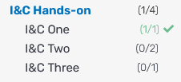
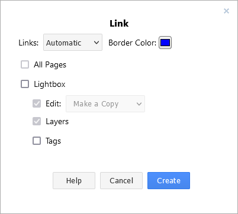

---



---

Here you will find a guide that leads you through the **Learners** interface. Learners is the interface that gives you access to this documentation and allows you to access and perform the exercises. It also offers several additional features that are specifically discussed in this guide.

## Requirements

It is highly recommended that you use the latest version of the Firefox browser to access the learning environment. Furthermore, it is recommended that you have a screen resolution no less than Full High Definition (HD) – 1080p or 1920 x 1080 pixels. (Lower resolutions will work but the experience will not be as comfortable.)

## Navigation

In this section, you will find an overview of the individual components of Learners.

| Menu icon |  Component | Description |
|:---|:---|:---|
|  | **Documentation** | This menu icon will take you to this documentation and the agenda of the Regional Training Course. |
|  | **Exercises** | This menu icon will take you to the Exercises Section, which has the respective exercise descriptions and forms you can submit as exercise submissions. |
|  | **Client** | This icon gives you access to the client in the Cyber Range on which analyses and other exercises can be performed. |
|  | **MITRE ATT&CK®** | This icon takes you to the MITRE ATT&CK® Navigator, which is used in an exercise.  |
|  | **draw.io** | This icon will take you to a draw.io instance with the exercise a network topology already prepared, which will also be part of an exercise. |
|  | *open in new Tab* | Clicking on this icon opens the current page in a new browser tab, allowing you to use multiple screens, for example, to have the Exercises open next to the client. |

## Exercises

In this section, the exercises area and their executions are discussed.

On the left side you will find an overview of all exercises. The numbers in brackets next to the exercise names indicate which/how many exercises have already been submitted. Completed exercises are also marked with a checkmark. In principle, exercises that have already been completed can be submitted again, but only the last submission counts.

### Exercise Execution

The exercise submissions essentially consist of forms that can be filled out and then submitted. Some of the exercises require additional procedures, such as performing various analyses on the client. It is possible to switch between the client and the exercise form without losing the state.

#### 2.1.1. Client

If an exercise requires client execution, it can be accessed from the menu on the left side of the screen. Authentication should be automatic and without a request for credentials, if this is not the case please contact the exercise instructor 

From the client, you can access the components of the scenario located in the Cyber Range and connect to them via ssh.

#### 2.1.2. MITRE ATT&CK®

Further Exercises use the MITRE ATT&CK® Navigator, which can be reached via the "&" icon in the sidebar. However, this component opens in a new browser tab.

#### 2.1.2. draw.io

Also in a new browser tab a draw.io tab opens in which network topology exercises can be performed. The predefined network topology should be displayed directly when you click on the link. The goal of this type of exercise is to complete it, for more information see the corresponding exercise introduction in the Exercises View. In order to submit your changes, please use the **Publish** function of draw.io by navigating to **File -> Publish -> Link...**. This will open a modal box (as shown here in the image), make sure **Lightbox** and **Tags** are unchecked and click **create**. After that another modal box opens where you can **copy the whole path**. This is then to be entered in the Exercise-View via the text field.
